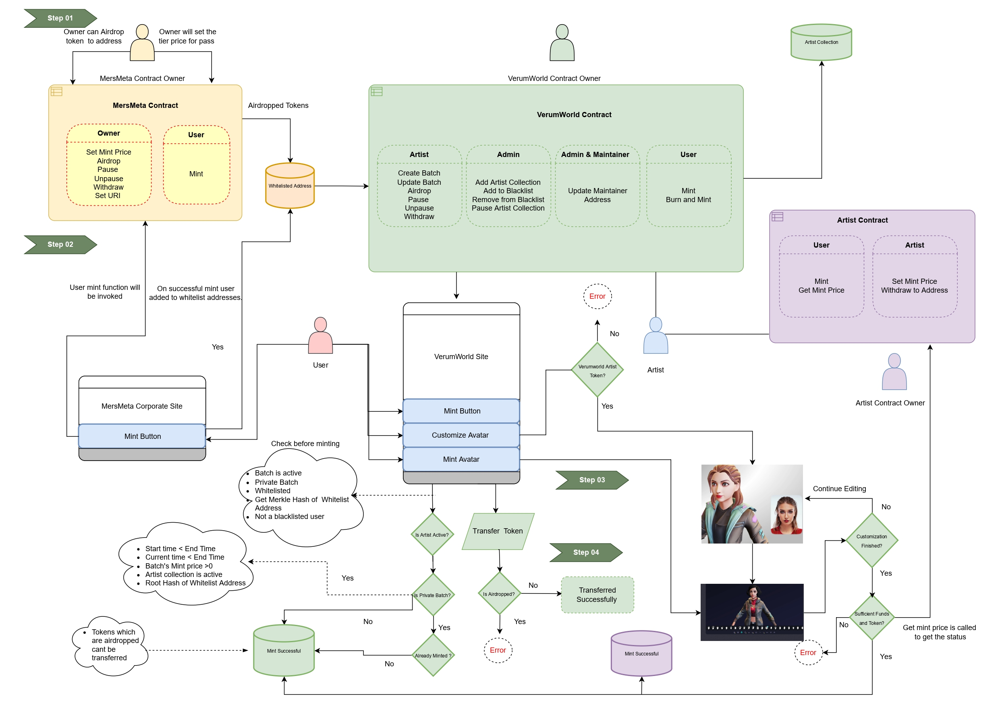

# Mersmeta Contracts Audit

# Project Overview 

In the Mersmeta Contract the owner of the contract can set the tiers different passes like Gold/ Silver/ Platinum. The price needs to be set by the owner, else users won't be able to mint from the website. The owner of the contract can airdrop the tokens as well as the users can mint for the tokens and the specific addresses which will be added in the whitelist address, and will be able to mint in the private batches of the VerumWorld Contract. 

VerumWorld contract is for communication between the artist contract and mersmeta contract. The contract will work as a service.  The artist will be added to verumworld once they are associated with Mersmeta. Each artist will have their collections and the pass for each artist will be different. 
The Artist can create batches which could be private or public, users can mint only if they have a particular artist’s pass (Mersmeta Pass) for private batches. Artist ID will be unique from backend, and price of mint for artist collection will be set by him/her. In case of any dispute or security issues the artist collection can be paused. 

The artist will have the Artist contract, specific to each artist. Users can burn the artist token to customize the avatar and once the customization gets over they can mint the token. When the user finishes the customization then the call from VerumWorld contract to Artist Contract will occur to check the sufficient funds.
The VerumWorld contract requests Artist contract and gets the current mint price. If the funds are available mint can be performed else it will be blocked. The withdraw function can be called when the transfer needs to happen in a particular address.

 
 

 

Step 01: The owner can set the tier price and airdrop the tokens. Once the price is set mint can be performed from user facing website.

Step 02: Owner can airdrop the entrypass or user can mint it to get access to second token.

Step 03: The user can transfer the token to other address if not airdropped.

Step 04: User can  burn their token to get access to customize their avatar which is not transferable.