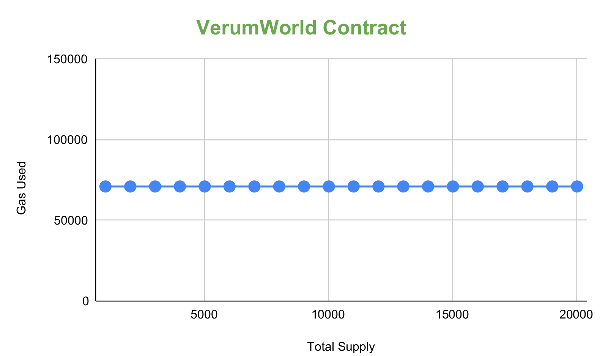

# VerumWorld Contract
Upgradeable contract for VerumWorld Contract
VerumWorld contract is for communication between the artist contract and mersmeta contract. The contract will work as a service.  The artist will be added to verumworld once they are associated with Mersmeta. Each artist will have their collections and the pass for each artist will be different. 
The Artist can create batches which could be private or public, users can mint only if they have a particular artist’s pass (Mersmeta Pass) for private batches. Artist ID will be unique from backend, and price of mint for artist collection will be set by him/her. In case of any dispute or security issues the artist collection can be paused. 


## Getting started

To make it easy for you to get started with GitLab, here's a list of recommended next steps.

## Table of Contents ##
1. [Setup](#setup)
2. [Commands](#commands)
3. [Contract Compile](#contract-compile)
4. [Contract Methods](#contract-methods)
5. [Truffle Config file](#truffle-config-file)
6. [Deploy On Local Network](#deploy-on-local-network)
7. [Deploy On Testnet Network](#deploy-on-testnet-network)
8. [Test Case Coverage](#test-case-coverage)
9. [Gas Limit Graph](#gas-limit-graph)

## Setup

1. System Setup 

You'll need node, npm and the Truffle Suite to set up the development environment. 

- [Node](https://nodejs.org/en/)
    - Version - 16.13.0
- [Truffle Suite](https://www.trufflesuite.com/)
    - Version - 5.5.3

2. Wallet Setup

You will need a Blockchain wallet (Metamask) to deploy and test these smart contracts.

- To create a wallet on metamask install the Metamask extension on your web browser.
- Click on the Metamask extension and select Create a Wallet option from there.
- Setup a password for your Metamask login (Remember this is your Metamask login password not the account password).
- Tap to reveal the Secret Recovery Phrase and keep it safe with you.
- Confirm your Secret Recovery Phrase saved with you to add your account to Metamask.
- Now you can switch between Ethereum mainnet and other Test Networks.

3. EtherScan Setup

- You will require the etherscan API KEY to verify and publish your smart contracts over the etherscan public networks.
- To create an account on Etherscan go to [EtherScan](https://etherscan.io/register).
- Move to API-KEYs tab and click on Add button.
- Give the name to your API-KEY and it will be created.

Update the .env file from the .env.sample and place the values for the required fields.

- Update the Secret Recovery Phrase for MNEMONIC field.
- Update the EtherScan API KEY for ETHERSCANKEY field.

4. .env Sample

```cmd
INFURA=<Place your Infura ID here>
MNEMONIC=<Place your Ethereum address seed phrase here>
ETHERSCANKEY=<Place your EtherScan API key here>
NAME=<Place your Token Name here>
SYMBOL=<Place your Token Symbol here>
BASEURI=<Place your Token URI here>
PAYEES=<Add your Payees Addresses with comma seprated>
SHARES=<Add your Payees Shares with comma seprated>
```


## Commands

  ```console
  npm install
  ``` 
    
  Install dependencies
    
  Dependencies List
  - @openzeppelin/test-helpers
  - @openzeppelin/contracts-upgradeable
  - @truffle/hdwallet-provider
  - dotenv
  - solidity-coverage
  - truffle
  - truffle-plugin-verify

## Contract Compile

  ```console
    truffle compile --all
  ```

  Compile the contracts

  Contracts List
  - AbstractERC1155Factory.sol
  - BlackList.sol
  - IArtist.sol
  - IVerumWorld.sol
  - Migrations.sol
  - MustafaCeceli.sol
  - VerumWorld.sol

## Contract Methods

  - mint - Mint a new token from the artist active batch
  - airDrop - Airdrop the tokens of the artist to the address from artist maintainer
  - addNewArtistCollection - Add a new artist collection to Verum World
  - pauseArtistCollection -  Pause or Unpause the artist collection
  - createBatchForArtistCollection - Create a new batch for the artist 
  - updateBatchMintPriceForArtistCollection - Update the batch mint price for the active artist collection batch
  - updateBatchEndTimeForArtistCollection - Update the batch end time for the active artist collection batch 
  - updateMaintainerAddress - Update the artist maintainer address
  - burnAndMint - Burn the artist Verum World token and mint the Avatar on Artist Contract
  - withdrawToAddress - Withdraw to the address provided for the artist share by the artist maintainer
  - addToBlackList - Adds the account to blacklist
  - removeFromBlackList - Removes the account from blacklist


## Truffle Config File

This file would use your Mnemonic key and EtherScan API KEY to deploy the smart contracts on local network as well Ethereum and Test Network. 
These values will be picked up either from .env file explained above or the environment variables of the host system.

```js
require('dotenv').config()
const HDWalletProvider = require('@truffle/hdwallet-provider');
const mnemonic = process.env.MNEMONIC;
const INFURA = process.env.INFURA;
const KEY = process.env.ETHERSCANKEY;

module.exports = {
  networks: {

    test: {
     host: "127.0.0.1",
     port: 8545,
     network_id: "*",
    },

    ropsten: {
      provider: () => new HDWalletProvider(mnemonic, `wss://ropsten.infura.io/ws/v3/${INFURA}`),
      network_id: 3,
      timeoutBlocks: 200,
      skipDryRun: true
    },

    rinkeby: {
      provider: () => new HDWalletProvider(mnemonic, `wss://rinkeby.infura.io/ws/v3/${INFURA}`),
      network_id: 4,
      timeoutBlocks: 200,
      skipDryRun: true
    },

    kovan: {
      provider: () => new HDWalletProvider(mnemonic, `wss://kovan.infura.io/ws/v3/${INFURA}`),
      network_id: 42,
      timeoutBlocks: 200,
      skipDryRun: true
    }
    
  },

  // Configure your compilers
  compilers: {
    solc: {
      version: "0.8.2",
      settings: {
        optimizer: {
          enabled: true,
          runs: 200
        }
      }
    }
  },

  mocha: {
    enableTimeouts: false,
    before_timeout: 3000000
  },

  plugins: [
    "solidity-coverage",
    "truffle-plugin-verify"
  ],

  api_keys: {
    etherscan: KEY
  }
};

```

## Deploy On Local Network

Network Name - test

- To run smart contract on test first start

    `ganache-cli`

    in another terminal

- To migrate the contracts 

    `truffle migrate --reset --network test`

    - This will use the migrations/2_deploy_contract.js file and deploy the Verumworld contract.

        This file would use your NAME, SYMBOL fields from .env file and pass to the smart contract.

- To test the contracts 

    `truffle test --network test`

    - This will use the test/utiltokenCoverage.test.js file and test the VerumWorld contract.

## Deploy On Testnet Network

Network Name - testnet

- To migrate the contracts 

    `truffle migrate --network testnet`

    - This will use the migrations/2_deploy_contract.js file and deploy the VerumWorld contract.

        This file would use your NAME, SYMBOL fields from .env file and pass to the smart contract.

## Deploy On rinkeby Network 

Network Name - rinkeby

- To migrate the contracts 

    `truffle migrate --reset --network rinkeby`

    - This will use the migrations/2_deploy_contract.js file and deploy the VerumWorld contract.

        This file would use your NAME, SYMBOL fields from .env file and pass to the smart contract.
        Make sure you enter the correct addresses you which to give the respective roles.
        Before deploying the contract to Mainnet make sure you have tested everything on local and corrected, as deployment on Mainnet will involve real coins and gas fees.

## Test Case Coverage

To run the unit test case coverage on the smart contract we have used solidity-coverage npm package. The command to run the test coverage is:

- `truffle run coverage` 


File                         |  % Stmts | % Branch |  % Funcs |  % Lines |Uncovered Lines |
-----------------------------|----------|----------|----------|----------|----------------|
 contracts/                  |    92.57 |    77.91 |       85 |     92.9 |                |
  AbstractERC1155Factory.sol |      100 |      100 |      100 |      100 |                |
  BlackListUpgradeable.sol   |      100 |      100 |      100 |      100 |                |
  IArtistCollectibles.sol    |      100 |      100 |      100 |      100 |                |
  IVerumWorld.sol            |      100 |      100 |      100 |      100 |                |
  MustafaCeceli.sol          |    60.71 |       25 |    45.45 |    63.33 |... 100,105,110 |
  VerumWorld.sol             |      100 |    86.11 |      100 |      100 |                |
-----------------------------|----------|----------|----------|----------|----------------|
All files                    |    92.57 |    77.91 |       85 |     92.9 |               

## Gas Limit Graph

The gas limit graph for minting the tokens using the VerumWorld Contract for every 1000 tokens.

